## РОССИЙСКИЙ УНИВЕРСИТЕТ ДРУЖБЫ НАРОДОВ  
### Факультет физико-математических и естественных наук  
### Кафедра прикладной информатики и теории вероятностей  

#### ОТЧЕТ ПО  
#### ЛАБОРАТОРНОЙ РАБОТЕ №1  

*дисциплина: Научное программирование*  

Студент: Меньшов Иван Сергеевич  
Группа: НПМмд-02-21  
Ст. билет № 1032212347

**Цель работы**  
Изучить идеологию и применение средств контроля версий.

**Ход работы**

1) Создадим учётную запись на https://github.com.
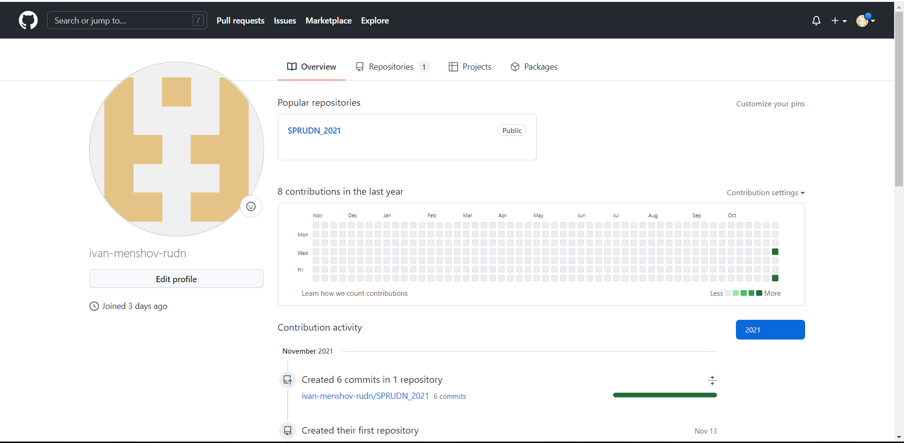

2) Установим git на наш компьтер.
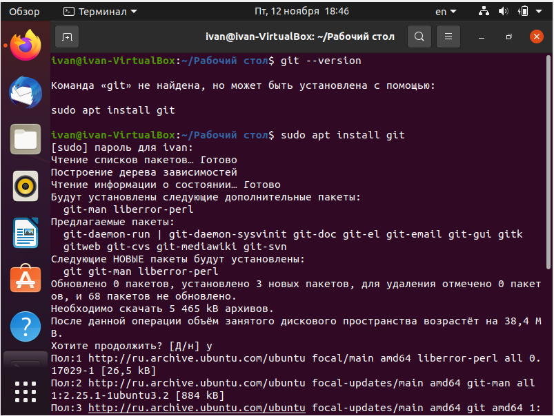
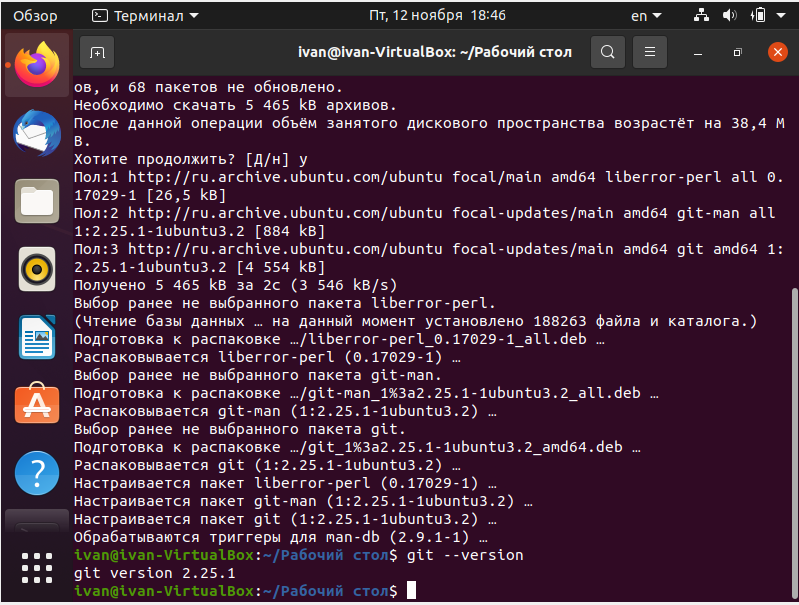

3) Настроим систему контроля версий git, как это указано в инструкции к 1-ой лаборатной работе  c использованием сервера репозиториев https://github.com/.

Для этого необходимо сгенерировать пару ключей (приватный и открытый), а затем вставить их в SSH-ключи на github.

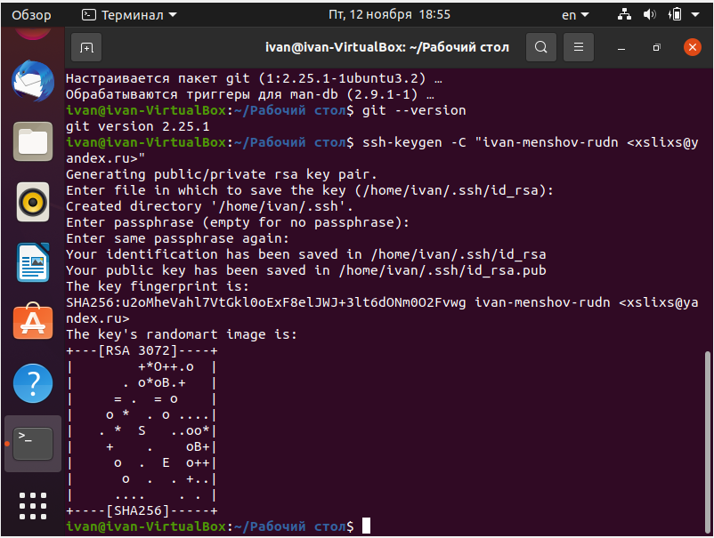
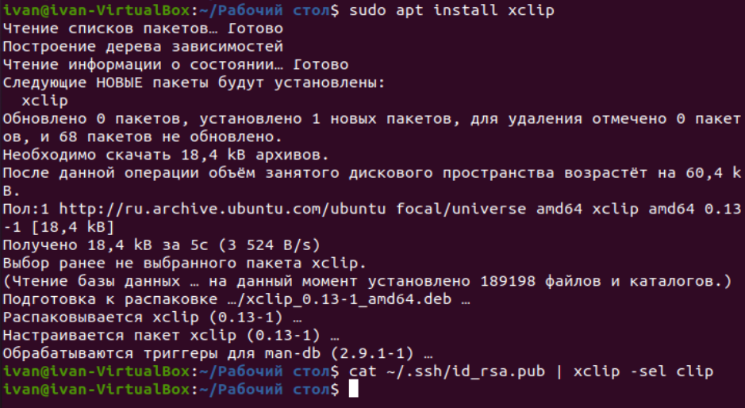
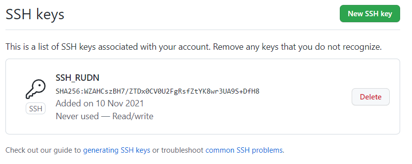

4) Создадим структуру каталога лабораторных работ согласно пункту М.2.

5) Подключение репозитория к github

Создадим репозиторий на GitHub.

Рабочий каталог будем обозначать как laboratory. Вначале нужно перейти в этот
каталог:

–cd laboratory

Инициализируем системы git:

–git init

Создаём заготовку для файла README.md:

–echo "# Лабораторные работы" >> README.md

–git add README.md

Делаем первый коммит и выкладываем на github:

–git commit -m "first commit"

–git remote add origin git@github.com:<username>/sciproc-intro.git

–git push -u origin master

Результат проделанных операций представлен ниже.
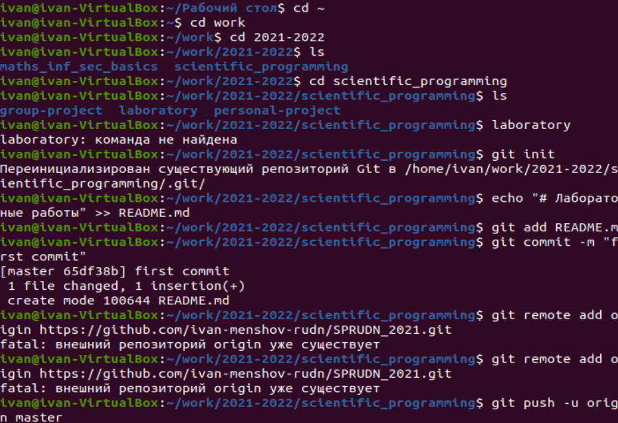
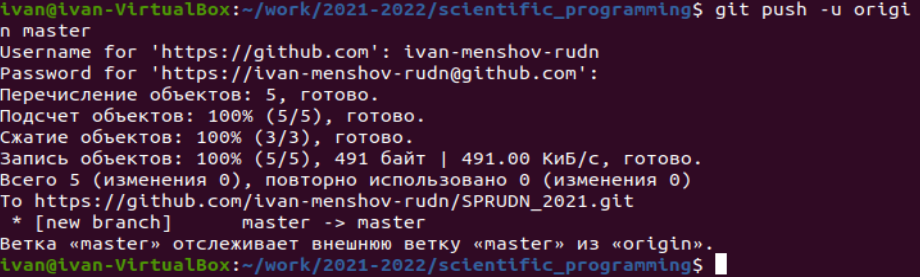
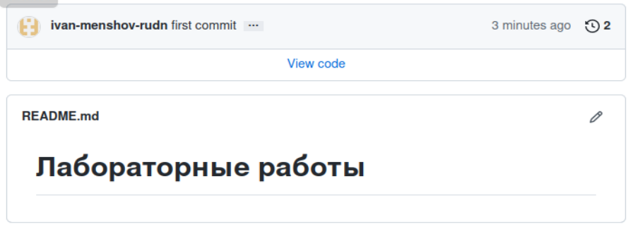

6) Первичная конфигурация

Добавим файл лицензии:

–wget https://creativecommons.org/licenses/by/4.0/legalcode.txt -O

Добавим шаблон игнорируемых файлов. Просмотрим список имеющихся шаблонов:
–curl -L -s https://www.gitignore.io/api/list

Затем скачаем шаблон, например, для C:

–curl -L -s https://www.gitignore.io/api/c >> .gitignore

Можно это же сделать через web-интерфейс на сайте https://www.gitignore.io/.

Добавим новые файлы:

–git add .
Выполним коммит:

–git commit -a
Отправим на github:

–git push

Результат проделанных операций представлен ниже.

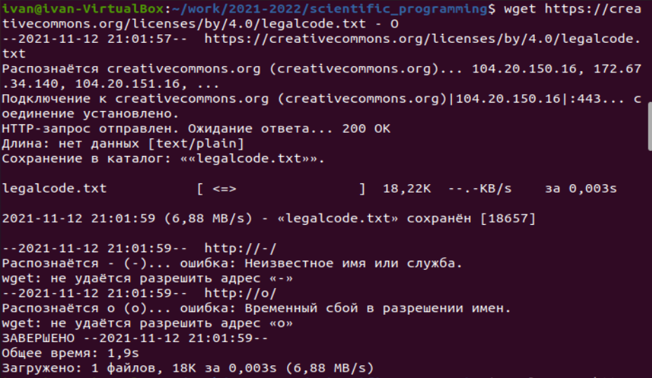
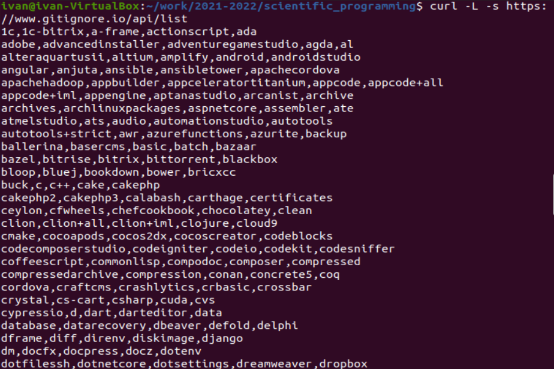
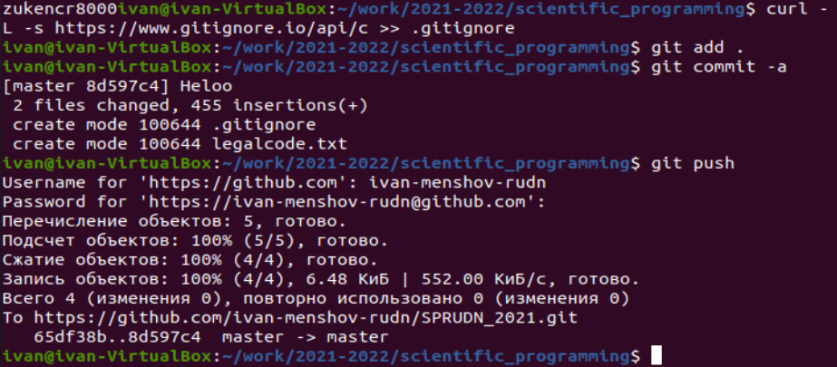
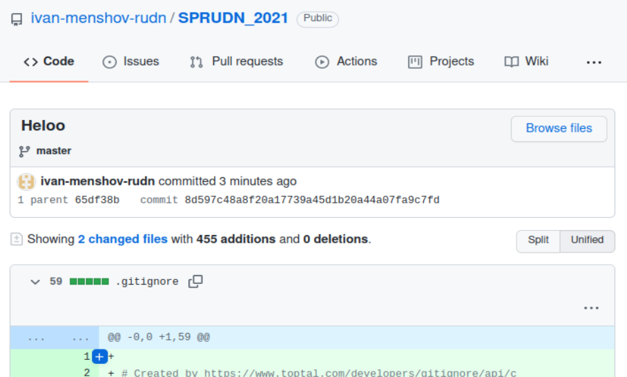

7) Конфигурация git-flow

– Инициализируем git-flow

git flow init

Префикс для ярлыков установим в v.

– Проверьте, что Вы на ветке develop:

git branch

– Создадим релиз с версией 1.0.0

git flow release start 1.0.0

– Запишем версию:

echo "1.0.0" >> VERSION
– Добавим в индекс:

git add .

git commit -am 'chore(main): add version'

– Зальём релизную ветку в основную ветку

git flow release finish 1.0.0

– Отправим данные на github

git push --all

git push --tags

– Создадим релиз на github.

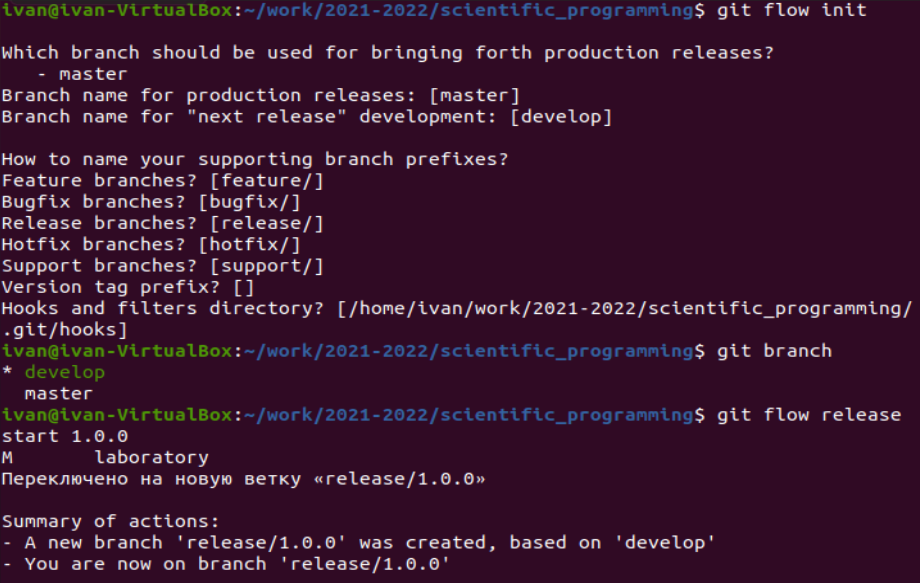
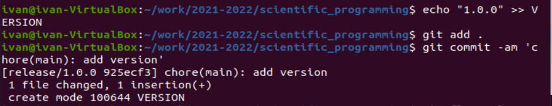
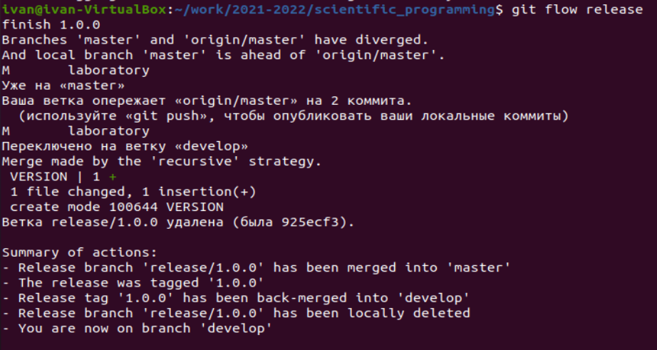
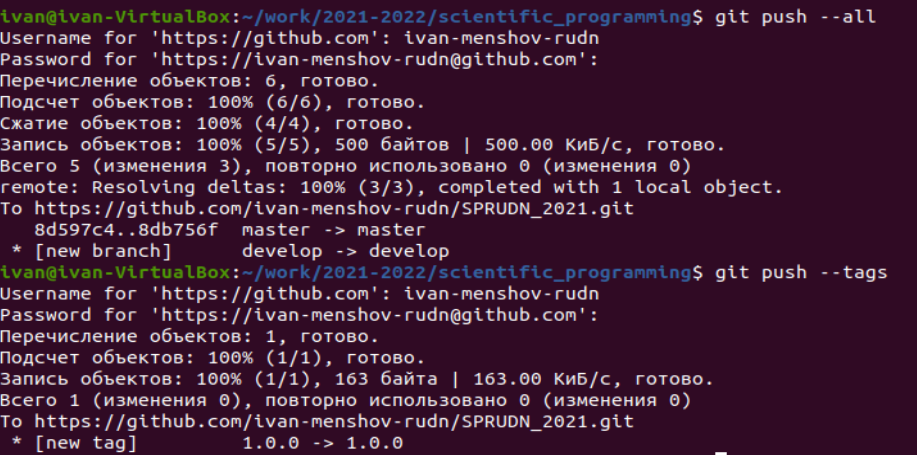
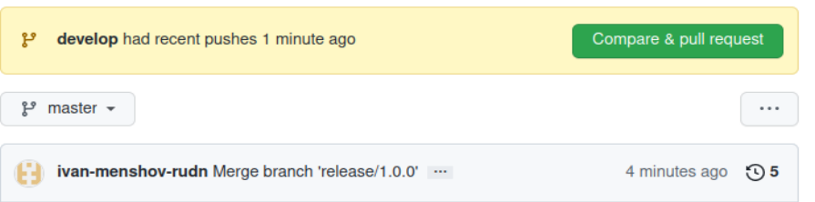

**Выводы**

Были изучена идеология и применение средств контроля версий.

**Контрольные вопросы**

1. Что такое системы контроля версий (VCS) и для решения каких задач они предназначаются?

• Системы контроля версий (Version Control System, VCS) применяются при работе
нескольких человек над одним проектом.

2. Объясните следующие понятия VCS и их отношения: хранилище, commit, история,
рабочая копия.

• Хранилище (repository), или репозитарий, —место хранения всех версий и служебной информации. Commit («[трудовой] вклад», не переводится) — синоним версии; процесс создания новой версии. Рабочая копия (working copy) — текущее состояние файлов проекта, основанное на версии, загруженной из хранилища (обычно на последней).

3. Что представляют собой и чем отличаются централизованные и децентрализованные
VCS? Приведите примеры VCS каждого вида.

• Централизованные системы контроля версий представляют собой приложения типа клиент-сервер, когда репозиторий проекта существует в единственном экземпляре и хранится на сервере. Доступ к нему осуществлялся через специальное клиентское приложение. В качестве примеров таких программных продуктов можно привести CVS, Subversion.аспределенные системы контроля версий (Distributed Version Control System, DVCS) позволяют хранить репозиторий (его копию) у каждого разработчика, работающего с данной системой. При этом можно выделить центральный репозиторий (условно), в который будут отправляться изменения из локальных и, с ним же эти локальные репозитории будут синхронизироваться. При работе с такой системой, пользователи периодически синхронизируют свои локальные репозитории с центральным и работают непосредственно со своей локальной копией. После внесения достаточного количества изменений в локальную копию они (изменения) отправляются на сервер. При этом сервер, чаще всего, выбирается условно, т.к. в большинстве DVCS нет такого понятия как “выделенный сервер с центральным репозиторием”.

4. Опишите действия с VCS при единоличной работе с хранилищем.

5. Опишите порядок работы с общим хранилищем VCS.

6. Каковы основные задачи, решаемые инструментальным средством git?

•Возврат к любой версии кода из прошлого. Просмотр истории изменений. Совместная работа без боязни потерять данные или затереть чужую работу.

7. Назовите и дайте краткую характеристику командам git.

• Наиболее часто используемые команды git:

– создание основного дерева репозитория:

git init

– получение обновлений (изменений) текущего дерева из центрального репозитория:
git pull

– отправка всех произведённых изменений локального дерева в центральный репозиторий:

git push
– просмотр списка изменённых файлов в текущей директории:
git status

– просмотр текущих изменения:

git diff

– добавить все изменённые и/или созданные файлы и/или каталоги:
git add .

– добавить конкретные изменённые и/или созданные файлы и/или каталоги:

git add имена_файлов
– удалить файл и/или каталог из индекса репозитория (при этом файл и/или каталог
остаётся в локальной директории):

git rm имена_файлов

– сохранение добавленных изменений:

– сохранить все добавленные изменения и все изменённые файлы:
git commit -am 'Описание коммита'

– сохранить добавленные изменения с внесением комментария через встроенный
редактор:

git commit

– создание новой ветки, базирующейся на текущей:
git checkout -b имя_ветки

– переключение на некоторую ветку:

git checkout имя_ветки

– отправка изменений конкретной ветки в центральный репозиторий:

git push origin имя_ветки

– слияние ветки с текущим деревом:

git merge --no-ff имя_ветки

8. Приведите примеры использования при работе с локальным и удалённым репозиториями.

• См пункты 1.3.3 -1.3.4

9. Что такое и зачем могут быть нужны ветви (branches)?

• Ветки нужны для того, чтобы программисты могли вести совместную работу над проектом и не мешать друг другу при этом.

10. Как и зачем можно игнорировать некоторые файлы при commit?

• Игнорируемые файлы — это, как правило, артефакты сборки и файлы, генерируемые машиной из исходных файлов в вашем репозитории, либо файлы, которые по какой-либо иной причине не должны попадать в коммиты. Для этого нужно указать название все игноиремых файлов в файде с названием .gitignore
