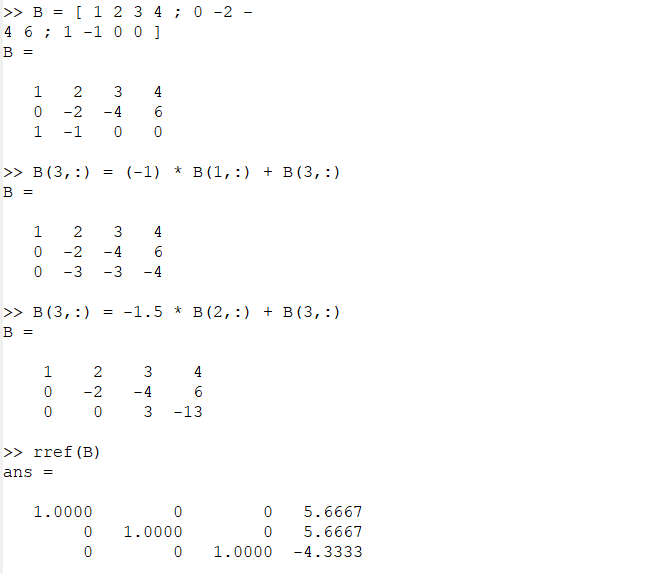
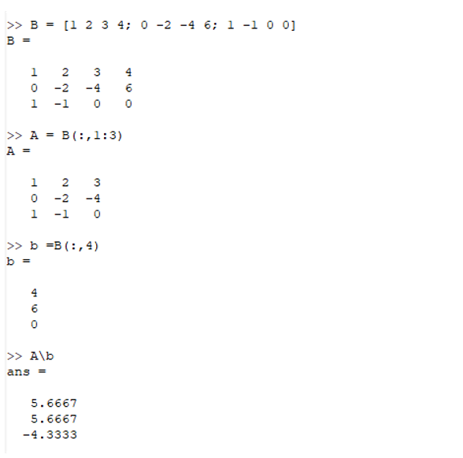
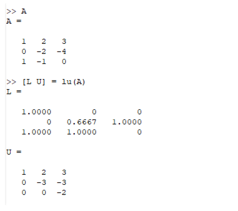
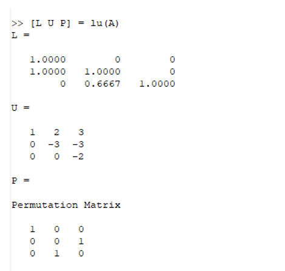

---
## Front matter
lang: ru-RU
title:  Системы линейных уравнений
author: Меньшов Иван Сергеевич
institute: Российский Университет Дружбы Народов
date: 02 декабря, 2021, Москва, Россия

## Formatting
mainfont: PT Serif
romanfont: PT Serif
sansfont: PT Sans
monofont: PT Mono
toc: false
slide_level: 2
theme: metropolis
header-includes: 
 - \metroset{progressbar=frametitle,sectionpage=progressbar,numbering=fraction}
 - '\makeatletter'
 - '\beamer@ignorenonframefalse'
 - '\makeatother'
aspectratio: 43
section-titles: true
---

# Цели и задачи

## Цель лабораторной работы

Познакомиться с методами исследования систем линейных уравнений в Octave

# Выполнение лабораторной работы

## Метод Гаусса

В Octave решить систему уранений можно использовав метод Гаусса.

{ #fig:001 width=70% height=70%}

## Левое деление

Встроенная операция для решения линейных систем вида: Ax = b в Octave называется левым делением и записывается как ```A\b```. Это концептуально
эквивалентно выражению A^(−1)^b

{ #fig:002 width=70% height=50%}

## LU-разложение

Пусть дана матрица A. С помощью Octave распишите её LU-разложение.

{ #fig:003 width=70% height=70%}

## LUP-разложение

LUP-разложение вычисляется в Octave с помощью команды:
```
[L U P] = lu (A)
```
{ #fig:004 width=70% height=70%}

# Выводы

## Результаты выполнения лабораторной работы

В ходе выполнения данной работы я научилcя работать с системами линейных уравнений, с подгонкой полиномиальной кривой и с матричными преобразованиями, а также я научился производить LU- разложение матриц.