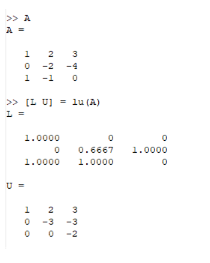

---
# Front matter
lang: ru-RU
title: "Научное програмирование"
subtitle: "Отчет по лабораторной работе № 4"
author: "Меньшов Иван Сергеевич НПМмд-02-21"

# Formatting
toc-title: "Содержание"
toc: true # Table of contents
toc_depth: 2
lof: true # List of figures
fontsize: 12pt
linestretch: 1.5
papersize: a4paper
documentclass: scrreprt
polyglossia-lang: russian
polyglossia-otherlangs: english
mainfont: PT Serif
romanfont: PT Serif
sansfont: PT Sans
monofont: PT Mono
mainfontoptions: Ligatures=TeX
romanfontoptions: Ligatures=TeX
sansfontoptions: Ligatures=TeX,Scale=MatchLowercase
monofontoptions: Scale=MatchLowercase
indent: true
pdf-engine: lualatex
header-includes:
  - \linepenalty=10 # the penalty added to the badness of each line within a paragraph (no associated penalty node) Increasing the value makes tex try to have fewer lines in the paragraph.
  - \interlinepenalty=0 # value of the penalty (node) added after each line of a paragraph.
  - \hyphenpenalty=50 # the penalty for line breaking at an automatically inserted hyphen
  - \exhyphenpenalty=50 # the penalty for line breaking at an explicit hyphen
  - \binoppenalty=700 # the penalty for breaking a line at a binary operator
  - \relpenalty=500 # the penalty for breaking a line at a relation
  - \clubpenalty=150 # extra penalty for breaking after first line of a paragraph
  - \widowpenalty=150 # extra penalty for breaking before last line of a paragraph
  - \displaywidowpenalty=50 # extra penalty for breaking before last line before a display math
  - \brokenpenalty=100 # extra penalty for page breaking after a hyphenated line
  - \predisplaypenalty=10000 # penalty for breaking before a display
  - \postdisplaypenalty=0 # penalty for breaking after a display
  - \floatingpenalty = 20000 # penalty for splitting an insertion (can only be split footnote in standard LaTeX)
  - \raggedbottom # or \flushbottom
  - \usepackage{float} # keep figures where there are in the text
  - \floatplacement{figure}{H} # keep figures where there are in the text
---

# Цель работы

Познакомиться с методами исследования систем линейных уравнений в Octave


# Выполнение лабораторной работы

## Метод Гаусса
Octave содержит сложные алгоритмы, встроенные для решения систем линейных уравнений.
Для решения системы линейных уравнений:
Ax = b
методом Гаусса можно построить расширенную матрицу вида
B = (A|b).
Рассмотрим расширенную матрицу.

{ #fig:001 width=70% height=70%}

Ее можно просматривать поэлементно.

{ #fig:002 width=70% height=70%}

Это скаляр, хранящийся в строке 2, столбце 3.
Также можно извлечь целый вектор строки или вектор столбца, используя оператор  сечения. Сечение можно использовать для указания ограниченного диапазона. Если не указано начальное или конечное значение, то результатом оператора является полный диапазон.

{ #fig:003 width=70% height=70%}

Теперь реализуем  явно метод Гаусса.
Сначала добавим к третьей строке первую строку, умноженную на −1.

{ #fig:004 width=70% height=70%}

Далее добавим к третьей строке вторую строку, умноженную на −1.5.

{ #fig:005 width=70% height=70%}

Матрица теперь имеет треугольный вид.Продолжая выполнять операции на матрицей получим ответ: 
5.66667; 5.66667; -4.33333 

{ #fig:006 width=70% height=70%}

{ #fig:007 width=70% height=70%}

Конечно, Octave располагает встроенной командой для непосредственного поиска
треугольной формы матрицы.
Обратите внимание, что все числа записываются в виде чисел с плавающей точкой
(то есть десятичных дробей). Пять десятичных знаков отображаются по умолчанию.
Переменные на самом деле хранятся с более высокой точностью, и при желании можно
отобразить больше десятичных разрядов.

{ #fig:008 width=70% height=70%}

## Левое деление

Встроенная операция для решения линейных систем вида: Ax = b в Octave называется левым делением и записывается как ```A\b```. Это концептуально
эквивалентно выражению A^(−1)^b . 

{ #fig:009 width=70% height=70%}

## LU-разложение

Пусть дана матрица A. С помощью Octave распишите её LU-разложение.

{ #fig:010 width=70% height=70%}

## LUP-разложение

LUP-разложение вычисляется в Octave с помощью команды:
```
[L U P] = lu (A)
```

{ #fig:011 width=70% height=70%}

# Вывод

В ходе выполнения данной работы я научилcя работать с системами линейных
уравнений, с подгонкой полиномиальной кривой и с матричными преобразованиями, а
также я научился производить LU- разложение матриц.