---
## Front matter
lang: ru-RU
title:  Пределы ,последовательности и ряды.
author: Меньшов Иван Сергеевич
institute: Российский Университет Дружбы Народов
date: 15 декабря, 2021, Москва, Россия

## Formatting
mainfont: PT Serif
romanfont: PT Serif
sansfont: PT Sans
monofont: PT Mono
toc: false
slide_level: 2
theme: metropolis
header-includes: 
 - \metroset{progressbar=frametitle,sectionpage=progressbar,numbering=fraction}
 - '\makeatletter'
 - '\beamer@ignorenonframefalse'
 - '\makeatother'
aspectratio: 43
section-titles: true
---

# Цели и задачи

## Цель лабораторной работы

Научиться работать с пределами, последовательностями и рядами, а также научиться писать векторизованный программный код.  

# Выполнение лабораторной работы

## Пределы. Оценка

Определяем с помощью анонимной функции простую функцию. Создаём индексную переменную, возьмём степени 10, и оценим нашу функцию.  

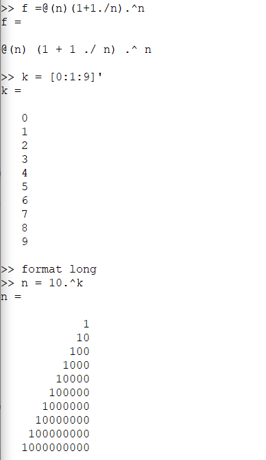{ #fig:001 width=50% height=50%}

## Пределы. Оценка 

Получим ответ. На следующей фигуре видно, что предел сходится к значению 2.71828.  

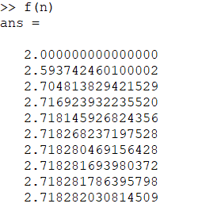{ #fig:002 width=70% height=70%}  

## Частичные суммы 

Определим индексный вектор, а затем вычислим члены. После чего введем последовательность частичных сумм, используя цикл. 

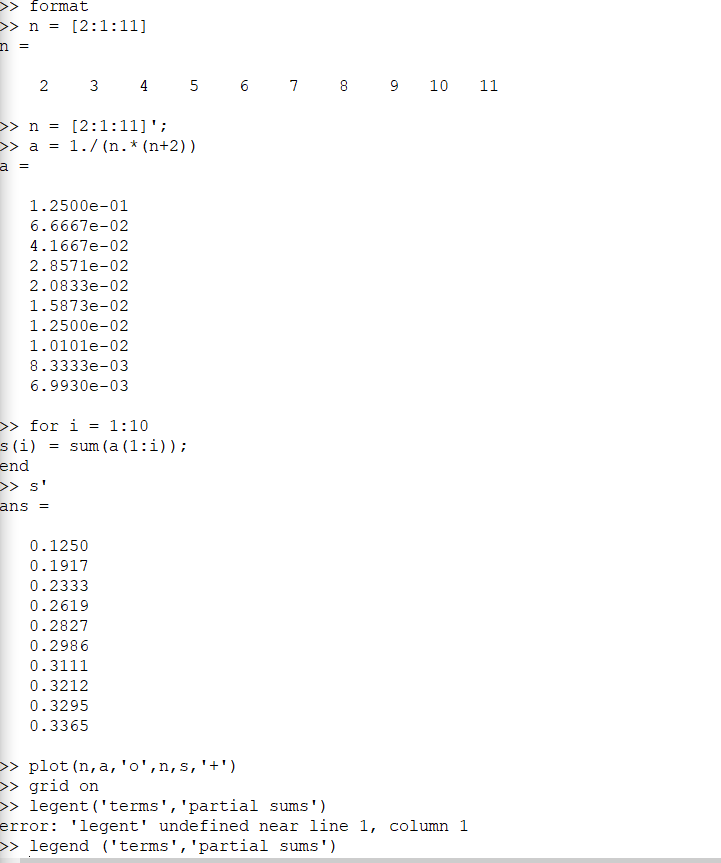{ #fig:003 width=50% height=50%}   

## Частичные суммы 

Построенные слагаемые и частичные суммы можно увидеть на следующем русинке:  

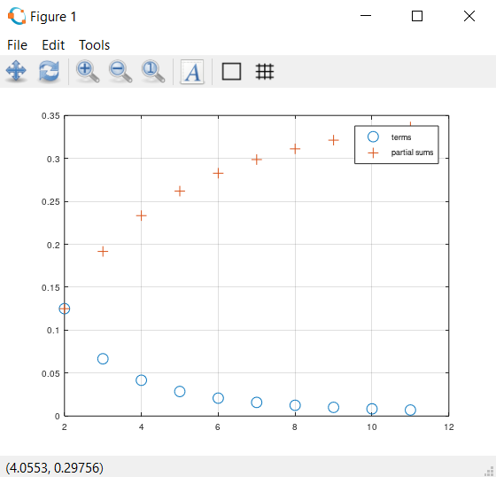{ #fig:004 width=70% height=70%} 

## Сумма ряда

Найдём сумму первых 1000 членов гармонического ряда 1/n.
 
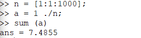{ #fig:005 width=70% height=70%}

## Вычисление интегралов 

Численно посчитаем интеграл.

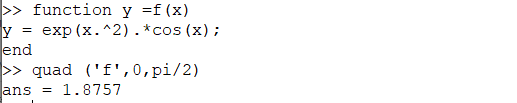{ #fig:006 width=70% height=70%}

## Аппроксимирование суммами 

Напишем скрипт для того, чтобы вычислить интеграл по правилу средней точки. Введём код в текстовый файл и назовём его midpoint.m.  

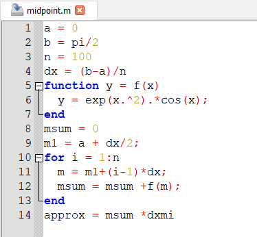{ #fig:007 width=50% height=50%} 

## Аппроксимирование суммами 

Запустим этот файл в командной строке. 

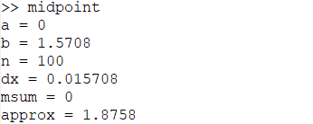{ #fig:008 width=70% height=70%} 

## Аппроксимирование суммами 

Теперь напишем векторизованный код, не требующий циклов. Для этого создадим вектор х-координат средних точек.Введём код в текстовый файл и назовём его midpoint_v.m.    

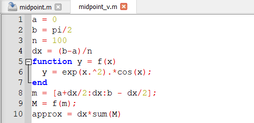{ #fig:009 width=50% height=50%}

## Аппроксимирование суммами 

Запустим этот файл в командной строке.

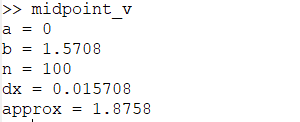{ #fig:010 width=70% height=70%} 

## Аппроксимирование суммами 

Запустив оба кода, можно заметить, что ответы совпадают, однако векторизованный код считает быстрее, так как в нём не использованы циклы, которые значительно замедляют работу программы. 

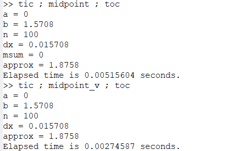{ #fig:011 width=50% height=50%}

# Выводы

## Результаты выполнения лабораторной работы

В ходе выполнения данной работы я научился работать с пределами, последовательностями и рядами, а также научился писать векторизованный программный код. Более того, удалось определить, что векторизованный код работает намного быстрее, чем код с циклами.