---
# Front matter
lang: ru-RU
title: "Научное програмирование"
subtitle: "Отчет по лабораторной работе № 6"
author: "Меньшов Иван Сергеевич НПМмд-02-21"

# Formatting
toc-title: "Содержание"
toc: true # Table of contents
toc_depth: 2
lof: true # List of figures
fontsize: 12pt
linestretch: 1.5
papersize: a4paper
documentclass: scrreprt
polyglossia-lang: russian
polyglossia-otherlangs: english
mainfont: PT Serif
romanfont: PT Serif
sansfont: PT Sans
monofont: PT Mono
mainfontoptions: Ligatures=TeX
romanfontoptions: Ligatures=TeX
sansfontoptions: Ligatures=TeX,Scale=MatchLowercase
monofontoptions: Scale=MatchLowercase
indent: true
pdf-engine: lualatex
header-includes:
  - \linepenalty=10 # the penalty added to the badness of each line within a paragraph (no associated penalty node) Increasing the value makes tex try to have fewer lines in the paragraph.
  - \interlinepenalty=0 # value of the penalty (node) added after each line of a paragraph.
  - \hyphenpenalty=50 # the penalty for line breaking at an automatically inserted hyphen
  - \exhyphenpenalty=50 # the penalty for line breaking at an explicit hyphen
  - \binoppenalty=700 # the penalty for breaking a line at a binary operator
  - \relpenalty=500 # the penalty for breaking a line at a relation
  - \clubpenalty=150 # extra penalty for breaking after first line of a paragraph
  - \widowpenalty=150 # extra penalty for breaking before last line of a paragraph
  - \displaywidowpenalty=50 # extra penalty for breaking before last line before a display math
  - \brokenpenalty=100 # extra penalty for page breaking after a hyphenated line
  - \predisplaypenalty=10000 # penalty for breaking before a display
  - \postdisplaypenalty=0 # penalty for breaking after a display
  - \floatingpenalty = 20000 # penalty for splitting an insertion (can only be split footnote in standard LaTeX)
  - \raggedbottom # or \flushbottom
  - \usepackage{float} # keep figures where there are in the text
  - \floatplacement{figure}{H} # keep figures where there are in the text
---

# Цель работы

Научиться работать с пределами, последовательностями и рядами, а также научиться писать векторизованный программный код.  

# Выполнение лабораторной работы

## Пределы. Оценка

Определяем с помощью анонимной функции простую функцию. Создаём индексную переменную, возьмём степени 10, и оценим нашу функцию.  

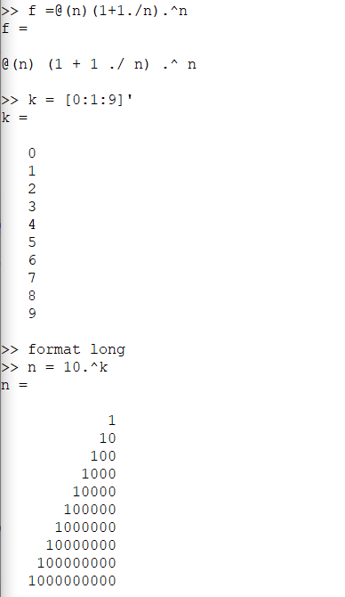{ #fig:001 width=50% height=50%} 

Получим ответ. На следующей фигуре видно, что предел сходится к значению 2.71828.  

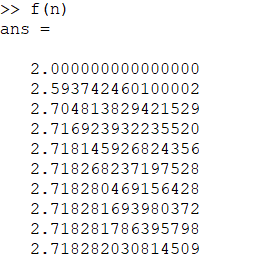{ #fig:002 width=70% height=70%}  

## Частичные суммы 

Определим индексный вектор, а затем вычислим члены. После чего введем последовательность частичных сумм, используя цикл. 

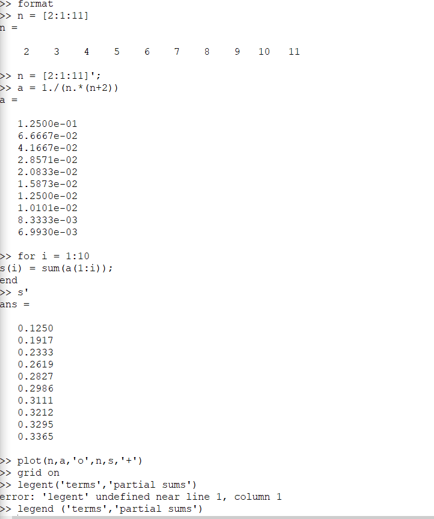{ #fig:003 width=70% height=70%}   

Построенные слагаемые и частичные суммы можно увидеть на следующем русинке:  

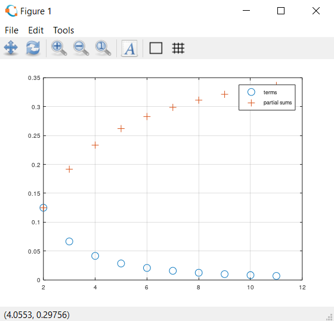{ #fig:004 width=70% height=70%} 

## Сумма ряда

Найдём сумму первых 1000 членов гармонического ряда 1/n.
 
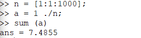{ #fig:005 width=70% height=70%}

## Вычисление интегралов 

Численно посчитаем интеграл.

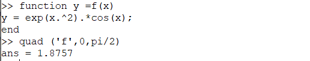{ #fig:006 width=70% height=70%}

## Аппроксимирование суммами 

Напишем скрипт для того, чтобы вычислить интеграл по правилу средней точки. Введём код в текстовый файл и назовём его midpoint.m.  

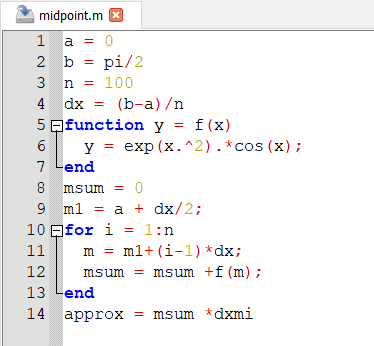{ #fig:007 width=70% height=70%} 

Запустим этот файл в командной строке. 

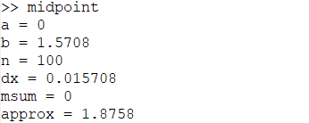{ #fig:008 width=70% height=70%}  

Теперь напишем векторизованный код, не требующий циклов. Для этого создадим вектор х-координат средних точек.Введём код в текстовый файл и назовём его midpoint_v.m.    

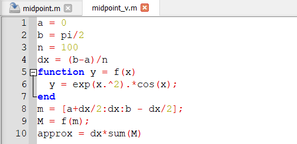{ #fig:009 width=70% height=70%}

Запустим этот файл в командной строке.

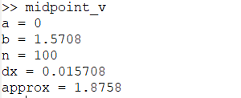{ #fig:010 width=70% height=70%}  

Запустив оба кода, можно заметить, что ответы совпадают, однако векторизованный код считает быстрее, так как в нём не использованы циклы, которые значительно замедляют работу программы. 

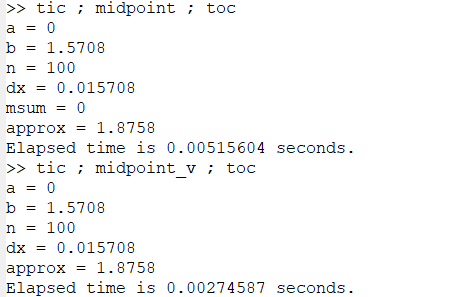{ #fig:011 width=70% height=70%})  

# Вывод 
В ходе выполнения данной работы я научился работать с пределами, последовательностями и рядами, а также научился писать векторизованный программный код. Более того, удалось определить, что векторизованный код работает намного быстрее, чем код с циклами.