---
## Front matter
lang: ru-RU
title:  Графики.
author: Меньшов Иван Сергеевич
institute: Российский Университет Дружбы Народов
date: 22 декабря, 2021, Москва, Россия

## Formatting
mainfont: PT Serif
romanfont: PT Serif
sansfont: PT Sans
monofont: PT Mono
toc: false
slide_level: 2
theme: metropolis
header-includes: 
 - \metroset{progressbar=frametitle,sectionpage=progressbar,numbering=fraction}
 - '\makeatletter'
 - '\beamer@ignorenonframefalse'
 - '\makeatother'
aspectratio: 43
section-titles: true
---

# Цель работы

Научиться строить различные виды графиков: параметрические, неявных функций, в полярных координатах. Обучиться работе с комплексными числами, изображать их на координатной плоскости.  

# Выполнение лабораторной работы

## Параметрические графики 

Построим график трёх периодов циклоиды радиуса 2. Для этого определим параметр как вектор в некотором диапазоне, затем вычислим x и y.

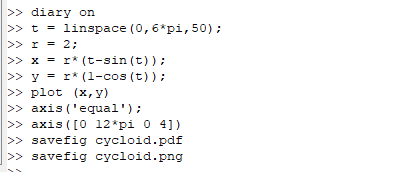{width=50% height=50%}  
 
Полученный график : 

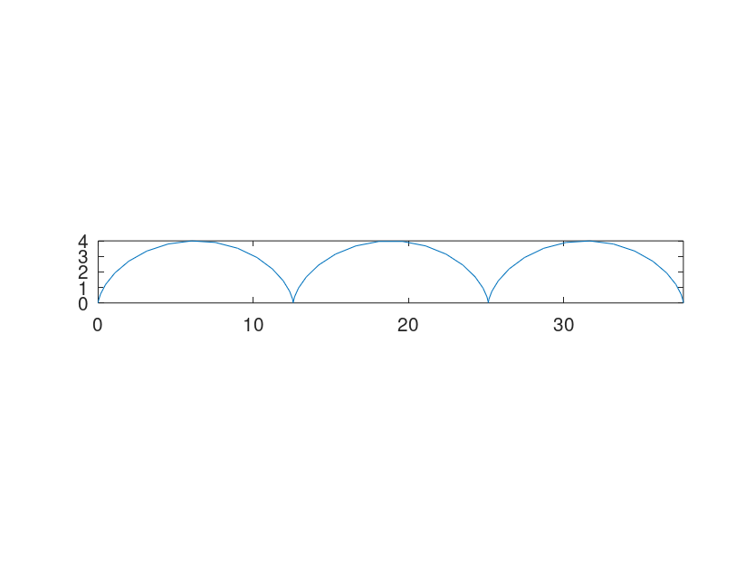{width=50% height=50%}   

## Полярные координаты 

Графики в полярных координатах строятся аналогичным образом. Построим улитку Паскаля.

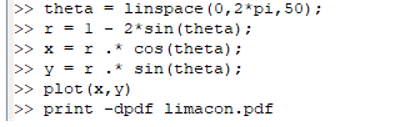{width=50% height=50%}  

Полученный график:

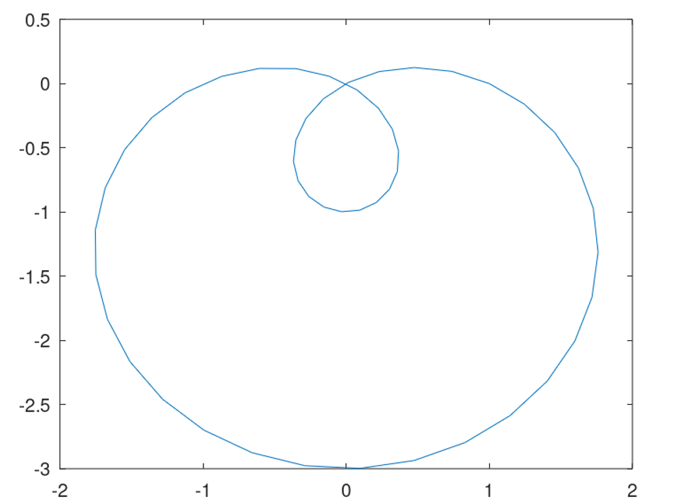{width=50% height=50%}

## Полярные координаты 

Более того, можно построить данный график в полярных осях.

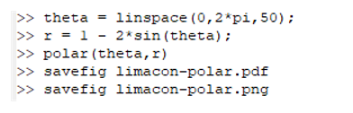{width=50% height=50%}

Полученный график:

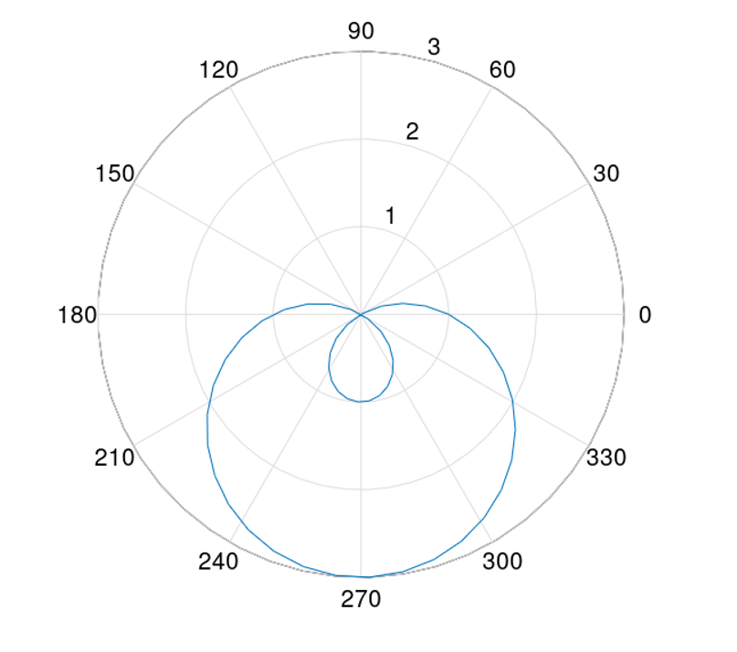{width=50% height=50%}

## Графики неявных функций  

Следует построить неявно определённую функцию с помощью ezplot. Зададим график функции, используя лямбда-функцию.  

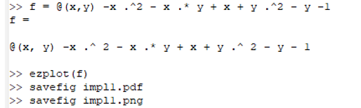{width=50% height=50%}  

После чего построим ее график.

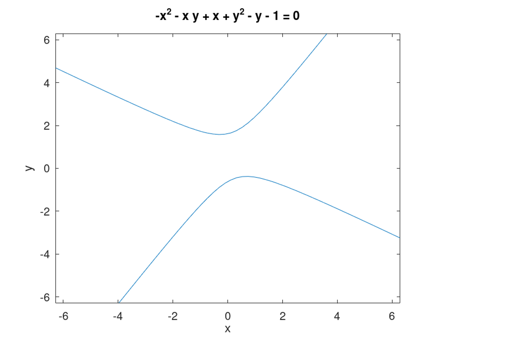{width=50% height=50%} 

## Графики неявных функций  

Найдём уравнение касательной к некоторой окружности. Сначала построим круг, используя лямбда-функцию. Далее найдём уравнение касательной.

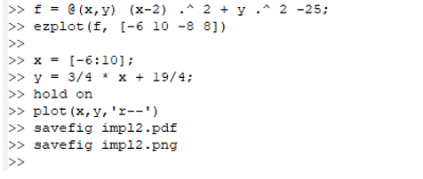{width=40% height=40%}
 
Полученный график: 

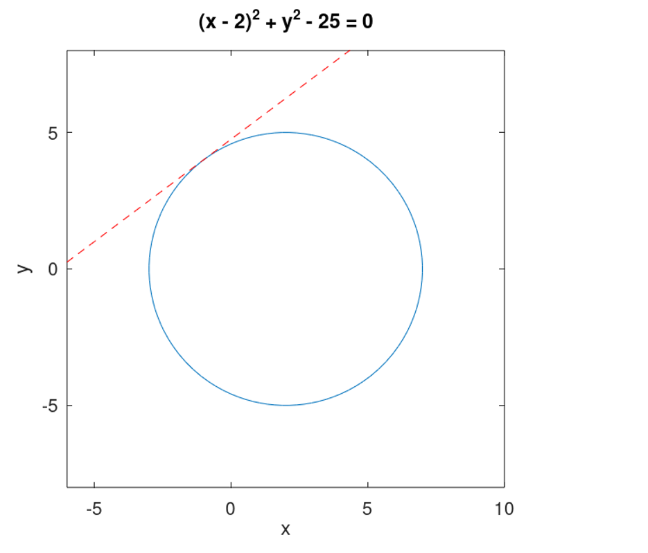{width=40% height=40%} 

## Комплексные числа

Зададим два комплексных числа и запишем основные арифметические операции с ними: сложение,вычитание,  умножение, деление.  

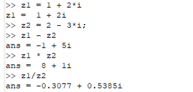{width=40% height=50%} 

Построим графики в комплексной плоскости, используя команду compass, используя команды, показанные ниже: 

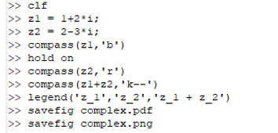{width=40% height=50%} 

## Комплексные числа

Полученный график:

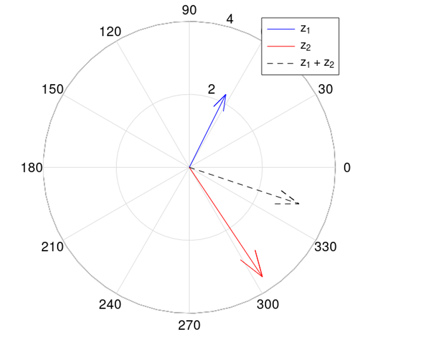{width=50% height=50%} 

## Специальные функции  

Построим гамма-функцию Г(х+1) и n! на одном графике.

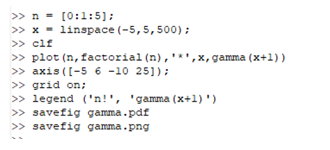{ #fig:015 width=40% height=40%} 

Полученный график:

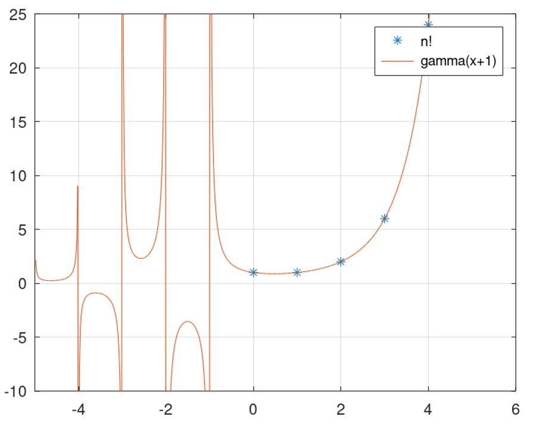{ #fig:016 width=40% height=40%}

## Специальные функции

Разделив область значения на отдельные интервалы, можно убрать артефакты вычислений. 

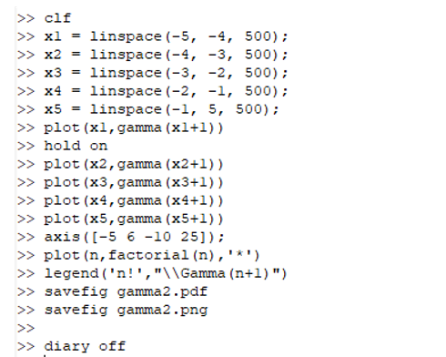{ width=30% height=30%}

Полученный график:

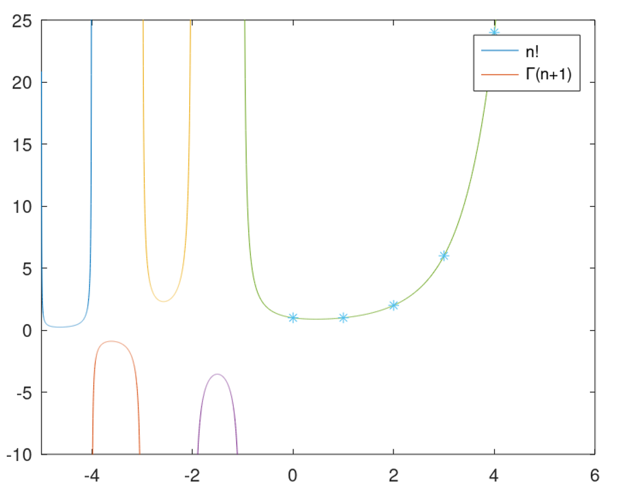{width=40% height=40%}

# Вывод  

В ходе выполнения данной работы я научился строить различные виды графиков: параметрические, неявных функций, в полярных координатах. Также поработал с комплексными числами, научился изображать их на координатной плоскости. А также построил гамма-функцию и график факториала. 