---
# Front matter
lang: ru-RU
title: "Научное програмирование"
subtitle: "Отчет по лабораторной работе № 7"
author: "Меньшов Иван Сергеевич НПМмд-02-21"

# Formatting
toc-title: "Содержание"
toc: true # Table of contents
toc_depth: 2
lof: true # List of figures
fontsize: 12pt
linestretch: 1.5
papersize: a4paper
documentclass: scrreprt
polyglossia-lang: russian
polyglossia-otherlangs: english
mainfont: PT Serif
romanfont: PT Serif
sansfont: PT Sans
monofont: PT Mono
mainfontoptions: Ligatures=TeX
romanfontoptions: Ligatures=TeX
sansfontoptions: Ligatures=TeX,Scale=MatchLowercase
monofontoptions: Scale=MatchLowercase
indent: true
pdf-engine: lualatex
header-includes:
  - \linepenalty=10 # the penalty added to the badness of each line within a paragraph (no associated penalty node) Increasing the value makes tex try to have fewer lines in the paragraph.
  - \interlinepenalty=0 # value of the penalty (node) added after each line of a paragraph.
  - \hyphenpenalty=50 # the penalty for line breaking at an automatically inserted hyphen
  - \exhyphenpenalty=50 # the penalty for line breaking at an explicit hyphen
  - \binoppenalty=700 # the penalty for breaking a line at a binary operator
  - \relpenalty=500 # the penalty for breaking a line at a relation
  - \clubpenalty=150 # extra penalty for breaking after first line of a paragraph
  - \widowpenalty=150 # extra penalty for breaking before last line of a paragraph
  - \displaywidowpenalty=50 # extra penalty for breaking before last line before a display math
  - \brokenpenalty=100 # extra penalty for page breaking after a hyphenated line
  - \predisplaypenalty=10000 # penalty for breaking before a display
  - \postdisplaypenalty=0 # penalty for breaking after a display
  - \floatingpenalty = 20000 # penalty for splitting an insertion (can only be split footnote in standard LaTeX)
  - \raggedbottom # or \flushbottom
  - \usepackage{float} # keep figures where there are in the text
  - \floatplacement{figure}{H} # keep figures where there are in the text
---

# Цель работы

Научиться строить различные виды графиков: параметрические, неявных функций, в полярных координатах. Обучиться работе с комплексными числами, изображать их на координатной плоскости.  

# Выполнение лабораторной работы
## Параметрические графики 

В самом начале работы включим журналирование. Построим график трёх периодов циклоиды радиуса 2. Для этого определим параметр как вектор в некотором диапазоне, затем вычислим x и y.

{ #fig:001 width=50% height=50%}  
 
Полученный график : 

{ #fig:002 width=50% height=50%}   

## Полярные координаты 

Графики в полярных координатах строятся аналогичным образом. Построим улитку Паскаля.

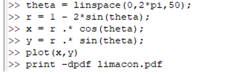{ #fig:003 width=50% height=50%}  

Полученный график:

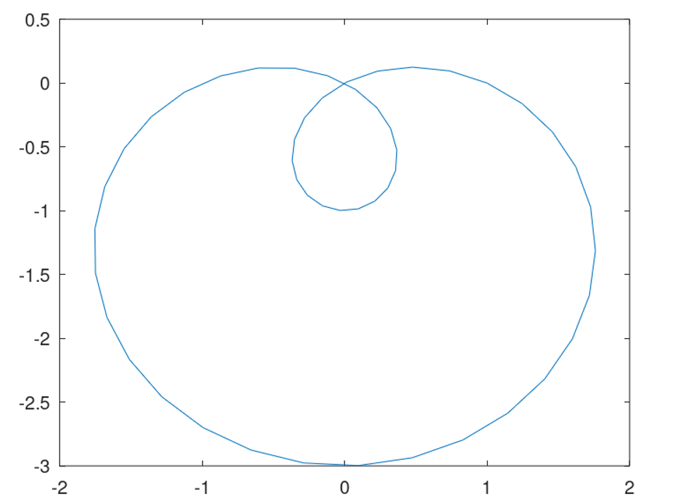{ #fig:004 width=50% height=50%}

Более того, можно построить данный график в полярных осях.

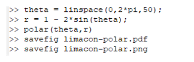{ #fig:005 width=50% height=50%}

Полученный график:

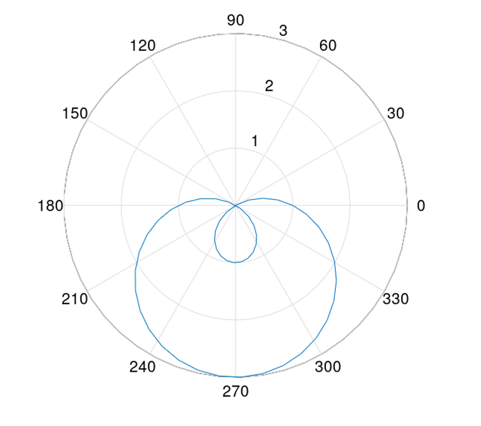{ #fig:006 width=50% height=50%}

## Графики неявных функций  

Следует построить неявно определённую функцию с помощью ezplot. Зададим график функции, используя лямбда-функцию.  

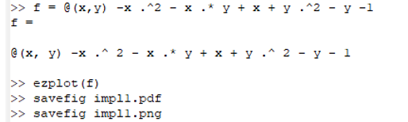{ #fig:007 width=50% height=50%}  

После чего построим ее график.

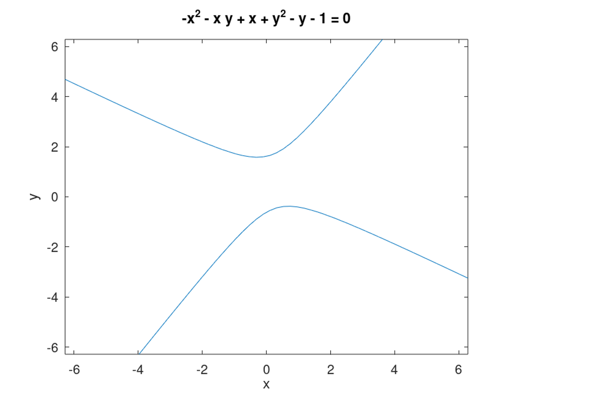{ #fig:008 width=50% height=50%} 

Найдём уравнение касательной к некоторой окружности. Сначала построим круг, используя лямбда-функцию. Далее по правилу дифференцирования найдём уравнение касательной и изобразим  ее на графике. 

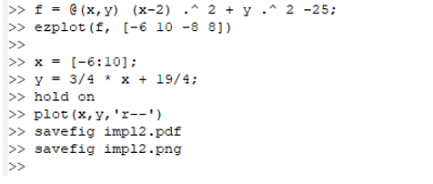{ #fig:009 width=50% height=50%}
 
Полученный график: 

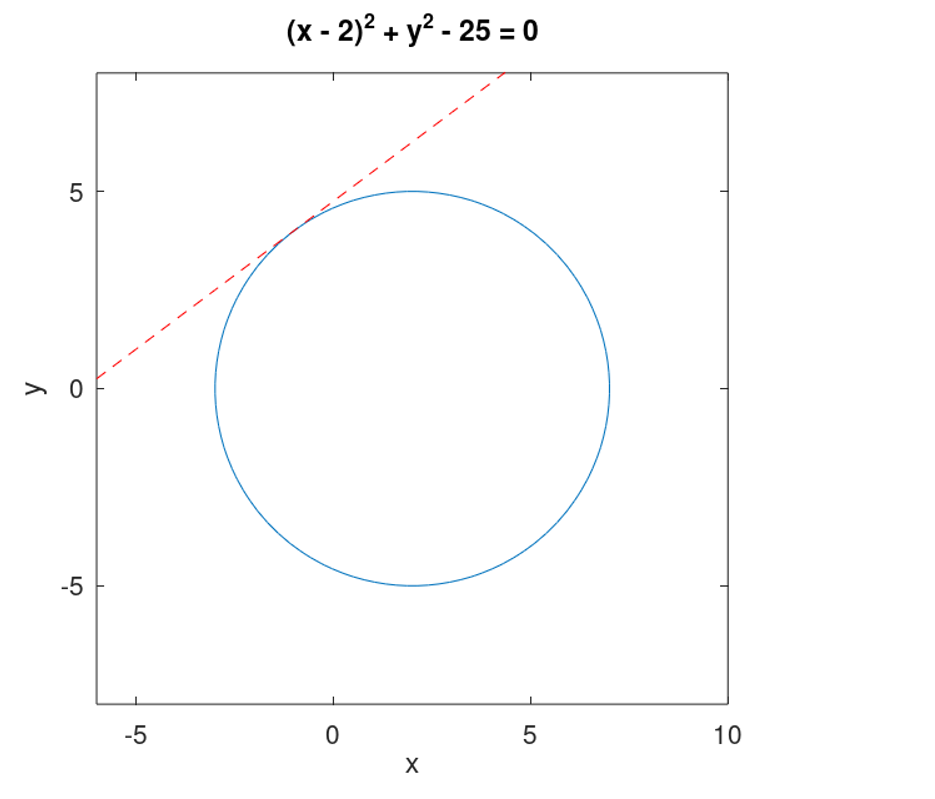{ #fig:010 width=50% height=50%} 

## Комплексные числа

Зададим два комплексных числа и запишем основные арифметические операции с ними: сложение,вычитание,  умножение, деление.  

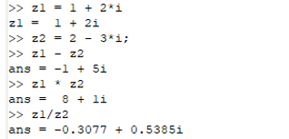{ #fig:011 width=50% height=50%} 

Построим графики в комплексной плоскости, используя команду compass, используя команды, показанные ниже: 

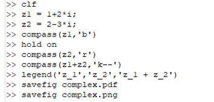{ #fig:012 width=50% height=50%} 

Полученный график:

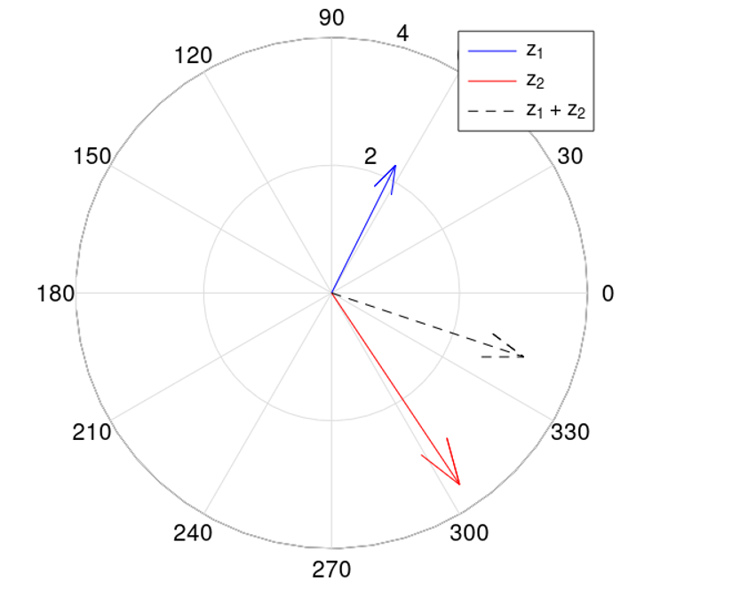{ #fig:013 width=50% height=50%} 

Иногда мы можем получить странные результаты вывода программы. При вычислении корня третьей степени из -8, мы ожидаем ответ -2, но получаем другое число. Это объясняется тем, что Octave возвращает тот ответ, у которого меньший аргумент. Для того, чтобы получить -2, мы должны использовать команду nthroot. 

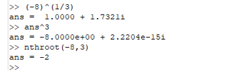{ #fig:014 width=50% height=50%} 

## Специальные функции  

Построим гамма-функцию Г(х+1) и n! на одном графике.

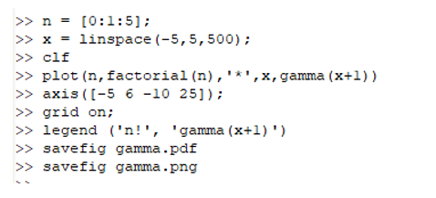{ #fig:015 width=50% height=50%} 

Полученный график:

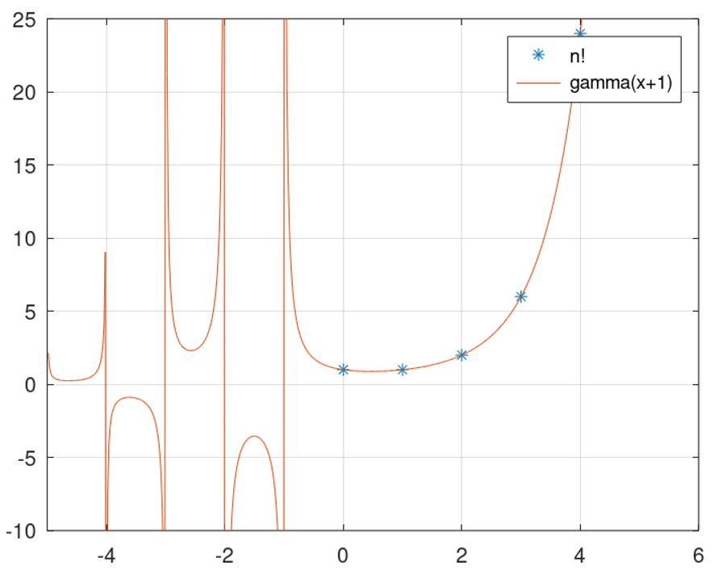{ #fig:016 width=50% height=50%}

Разделив область значения на отдельные интервалы, можно убрать артефакты вычислений. 

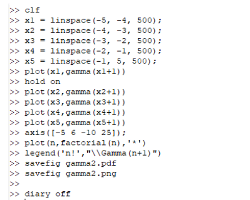{ #fig:017 width=50% height=50%}

После проведения вышеуказанных действий, построим график.

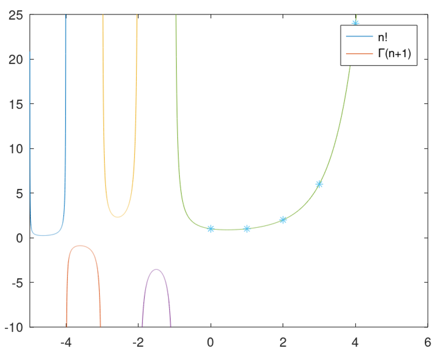{ #fig:018 width=50% height=50%}

# Вывод  

В ходе выполнения данной работы я научился строить различные виды графиков: параметрические, неявных функций, в полярных координатах. Также поработал с комплексными числами, научился изображать их на координатной плоскости. А также построил гамма-функцию и график факториала. 