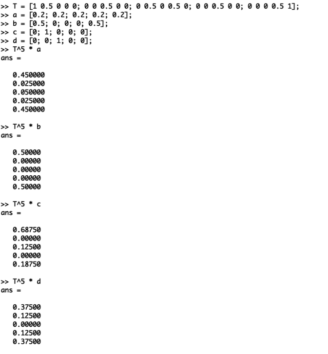

---
## Front matter
lang: ru-RU
title:  Задача на собственные значения
author: Меньшов Иван Сергеевич
institute: Российский Университет Дружбы Народов
date: 23 декабря, 2021, Москва, Россия

## Formatting
mainfont: PT Serif
romanfont: PT Serif
sansfont: PT Sans
monofont: PT Mono
toc: false
slide_level: 2
theme: metropolis
header-includes: 
 - \metroset{progressbar=frametitle,sectionpage=progressbar,numbering=fraction}
 - '\makeatletter'
 - '\beamer@ignorenonframefalse'
 - '\makeatother'
aspectratio: 43
section-titles: true
---

# Цель работы

Научиться находить собственные значения и собственные векторы матрицы, а также научиться предсказывать вероятность состояния системы.  

# Выполнение лабораторной работы

## Собственные значения и собственные векторы 

Включим журналирование работы. После чего зададим матрицу А. Для нахождения собственных значений и собственных векторов матрицы используем команду eig с двумя выходными аргументами.

{ #fig:001 width=50% height=50%}  

## Собственные значения и собственные векторы 
 
Для того, чтобы получить матрицу с действительными собственными значениями, создадим симмитричную матрицу путём умножения исходной матрицы на транспонированную. И повторим шаги, проделанные ранее.

{ #fig:002 width=50% height=50%}  

## Случайное блуждание 

На курсе "Теория случайных процессов" мы дополнительно ознакомились с цепями Маркова. Наша задача - предсказать вероятности состояния системы. Для примера случайного блуждания найдем вектор вероятности после 5 шагов для каждого начального вектора.

{ #fig:003 width=50% height=50%}  

## Случайное блуждание 

Теперь найдём вектор равновесного состояния для цепи Маркова с переходной матрицей.  

{ #fig:004 width=50% height=50%}  

## Случайное блуждание 

Таким образом, x = (0.37631  0.29287  0.33082), является вектором равновесного состояния.

{ #fig:005 width=50% height=50%}   
 
# Вывод 
 
В ходе выполнения данной работы я научилcя находить собственные значения и собственные векторы матрицы. Также научился работать с цепями Маркова и находить вектор равтовесия.  