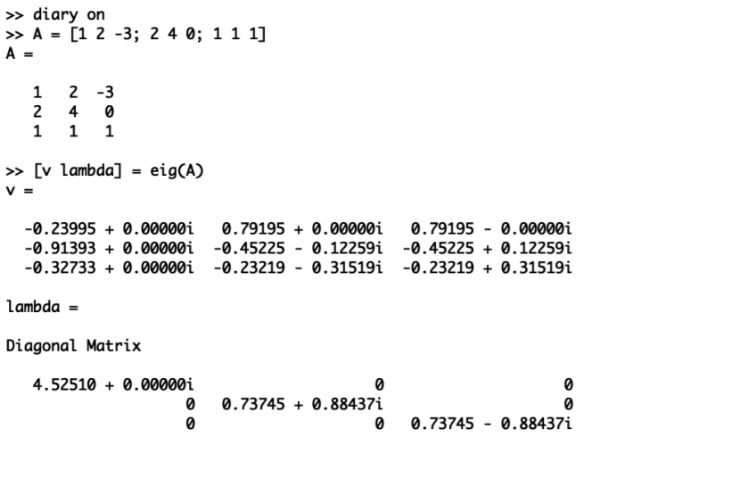
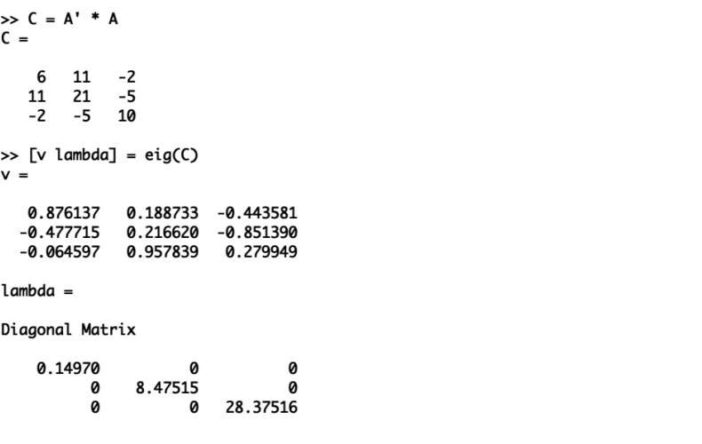
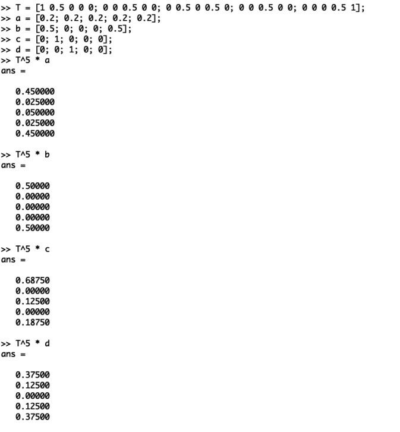
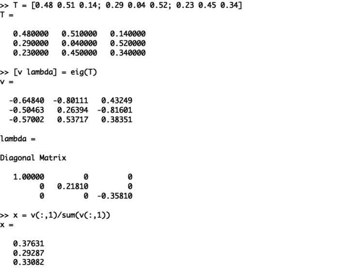
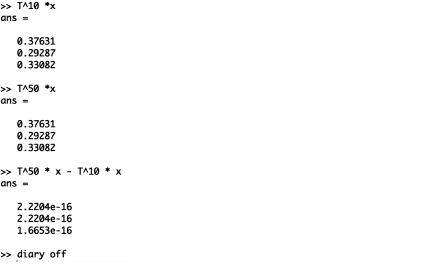

---
# Front matter
lang: ru-RU
title: "Научное програмирование"
subtitle: "Отчет по лабораторной работе № 8"
author: "Меньшов Иван Сергеевич НПМмд-02-21"

# Formatting
toc-title: "Содержание"
toc: true # Table of contents
toc_depth: 2
lof: true # List of figures
fontsize: 12pt
linestretch: 1.5
papersize: a4paper
documentclass: scrreprt
polyglossia-lang: russian
polyglossia-otherlangs: english
mainfont: PT Serif
romanfont: PT Serif
sansfont: PT Sans
monofont: PT Mono
mainfontoptions: Ligatures=TeX
romanfontoptions: Ligatures=TeX
sansfontoptions: Ligatures=TeX,Scale=MatchLowercase
monofontoptions: Scale=MatchLowercase
indent: true
pdf-engine: lualatex
header-includes:
  - \linepenalty=10 # the penalty added to the badness of each line within a paragraph (no associated penalty node) Increasing the value makes tex try to have fewer lines in the paragraph.
  - \interlinepenalty=0 # value of the penalty (node) added after each line of a paragraph.
  - \hyphenpenalty=50 # the penalty for line breaking at an automatically inserted hyphen
  - \exhyphenpenalty=50 # the penalty for line breaking at an explicit hyphen
  - \binoppenalty=700 # the penalty for breaking a line at a binary operator
  - \relpenalty=500 # the penalty for breaking a line at a relation
  - \clubpenalty=150 # extra penalty for breaking after first line of a paragraph
  - \widowpenalty=150 # extra penalty for breaking before last line of a paragraph
  - \displaywidowpenalty=50 # extra penalty for breaking before last line before a display math
  - \brokenpenalty=100 # extra penalty for page breaking after a hyphenated line
  - \predisplaypenalty=10000 # penalty for breaking before a display
  - \postdisplaypenalty=0 # penalty for breaking after a display
  - \floatingpenalty = 20000 # penalty for splitting an insertion (can only be split footnote in standard LaTeX)
  - \raggedbottom # or \flushbottom
  - \usepackage{float} # keep figures where there are in the text
  - \floatplacement{figure}{H} # keep figures where there are in the text
---

# Цель работы

Научиться находить собственные значения и собственные векторы матрицы, а также научиться предсказывать вероятность состояния системы.  

# Выполнение лабораторной работы

## Собственные значения и собственные векторы 

Включим журналирование работы. После чего зададим матрицу А. Для нахождения собственных значений и собственных векторов матрицы используем команду eig с двумя выходными аргументами.

{ #fig:001 width=50% height=50%}  
 
Для того, чтобы получить матрицу с действительными собственными значениями, создадим симмитричную матрицу путём умножения исходной матрицы на транспонированную. И повторим шаги, проделанные ранее.

{ #fig:002 width=50% height=50%}  

## Случайное блуждание 

На курсе "Теория случайных процессов" мы дополнительно ознакомились с цепями Маркова. Наша задача - предсказать вероятности состояния системы. Для примера случайного блуждания найдем вектор вероятности после 5 шагов для каждого начального вектора.Задаем матрицу, начальные векторы, а затем находим соответствующие вероятности.  

{ #fig:003 width=50% height=50%}  

Теперь найдём вектор равновесного состояния для цепи Маркова с переходной матрицей.  

{ #fig:004 width=50% height=50%}  

Таким образом, x = (0.37631  0.29287  0.33082), является вектором равновесного состояния.

{ #fig:005 width=50% height=50%}   
 
# Вывод 
 
В ходе выполнения данной работы я научилcя находить собственные значения и собственные векторы матрицы. Также научился работать с цепями Маркова и находить вектор равтовесия.  